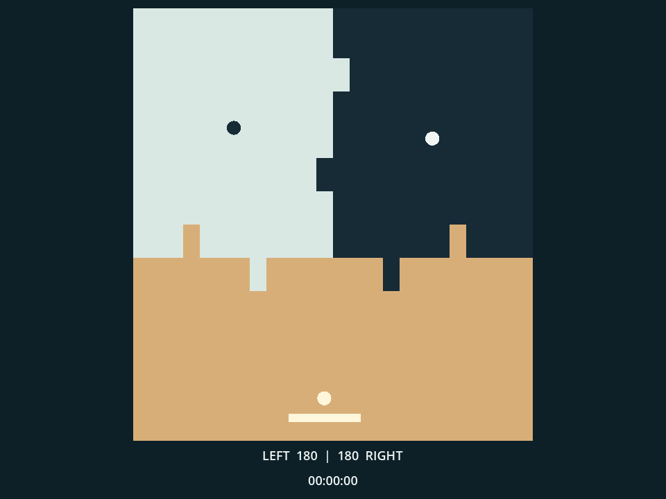
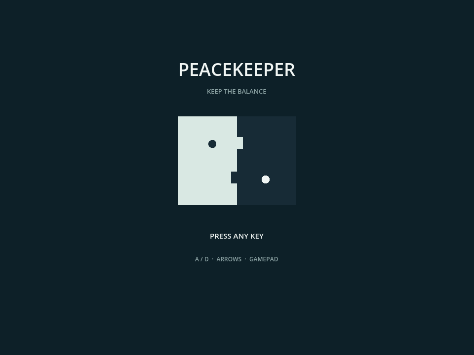

# PEACEKEEPER

PEACEKEEPER is a minimalist arcade game about intervening in an endless,
self-running conflict. Two autonomous factions repaint the battlefield while
you defend neutral territory with an Arkanoid-style paddle. Your goal is not
to win the war, but to keep both sides in balance and slow the advance of the
Doomsday Clock.

[Play PEACEKEEPER in your browser](https://yos-gh.github.io/peacekeeper/)



<details>
<summary>Title screen</summary>



</details>

## How to Play

The light and dark factions continuously invade each other's cells. Your ball
turns any faction cell it touches into neutral territory, then returns to the
paddle at the bottom of the field.

- Aim toward the faction with more territory.
- The paddle angle determines the ball's return direction.
- Missing the ball advances the Doomsday Clock by 38 minutes.
- Territory imbalance advances the clock quadratically. A difference of 20
  cells advances it by one hour every five real seconds.
- The game ends when the Doomsday Clock reaches `24:00:00`, when either faction
  disappears, or when no neutral territory remains.
- War balls accelerate to 4x speed after two minutes and eventually reach 8x.
  The player ball is capped at 2x speed.

## Controls

| Action | Keyboard | Gamepad | Touchscreen |
| --- | --- | --- | --- |
| Move paddle | `A` / `D` or arrow keys | D-pad or left stick | Virtual analog stick |
| Return to title | `Esc` | B / Circle | Upper-right button |
| Start / continue | Any key | Any button | Tap |

The virtual controls appear only on phones, tablets, and mobile browsers.
Pressing `Esc` on the title screen exits the game.

## Run Locally

PEACEKEEPER requires Godot 4.7 or later. Open `project.godot` in Godot and run
the project, or use:

```powershell
Godot.exe --path .
```

Run the regression test with:

```powershell
Godot_console.exe --headless --disable-crash-handler --log-file godot-smoke.log --path . --script res://tests/smoke_test.gd
```

## Build for the Web

Install the official Godot 4.7 export templates, then run:

```powershell
Godot_console.exe --headless --disable-crash-handler --path . --export-release Web web/game/index.html
```

The GitHub Pages workflow publishes the contents of `web`.

## Error Reporting

Exported builds use [Sentry for Godot 2.1.1](https://github.com/getsentry/sentry-godot/releases/tag/2.1.1)
for crash and error diagnostics. Default personal information, screenshots,
and scene-tree attachments are disabled. The SDK does not auto-initialize
during editor play.

## Inspiration

PEACEKEEPER is an original playable variation inspired by
[Pong Wars](https://github.com/vnglst/pong-wars) by Koen van Gilst. Pong Wars
is released under the MIT License and invites alternate versions of its core
idea.

## License

PEACEKEEPER is released under the [MIT License](LICENSE).
